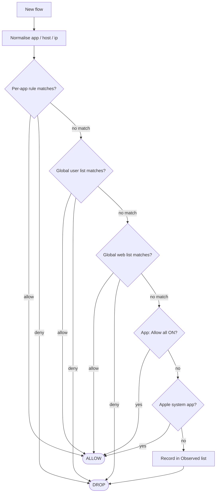

# Samaritan — firewall rule model

**Status: draft specification. No code written against this yet.**

This document turns the stated intent into a resolver that can actually be implemented, marks the
places where the intent was ambiguous or self-contradictory, and proposes a default for each so the
spec is usable even before every question is answered.

Notation used throughout:

- **[STATED]** — taken directly from the requirements.
- **[DERIVED]** — a consequence of a stated requirement plus a milestone-1 on-device finding.
- **[PROPOSED]** — a decision I made to fill a gap; overridable.
- **[Qn]** — an open question. Answers change behaviour. Collected in *Open questions*.
- **[VERIFY]** — depends on device behaviour not yet measured.

Milestone-1 findings referenced here are in [`../README.md`](../README.md).

---

## 1. Model

### 1.1 Core rule

**Default action is DENY.** [STATED]

Everything else is an exception. A flow is allowed only if some rule says so; no rule means dropped.

### 1.2 What a flow gives us

From `NEFilterDataProvider.handleNewFlow(_:)`, measured on iOS 26:

| Field | Availability |
|---|---|
| `sourceAppIdentifier` | Always, as **`<teamID>.<bundleID>`**. Apple's apps have an empty team: `.com.apple.mobilesafari`. |
| `remoteHostname` | Often, but **not always** |
| remote address | Often, but **not always** — many flows arrive with `::` (unspecified) |
| port, protocol, direction | Always |

Two facts drive the whole design:

1. **A flow can have a hostname and no address, an address and no hostname, or neither.** [DERIVED]
   A rule engine keyed only on IP prefixes silently misses a large share of traffic. Domain rules
   and IP rules are **peers**, not primary and fallback.
2. **The verdict is synchronous and final.** There is no pause-and-decide-later on iOS. Resolution
   must complete inline, in the low hundreds of microseconds.

### 1.3 App identity

Rules are keyed on the **full `sourceAppIdentifier` string**, and the bundle ID is what gets
displayed. [PROPOSED] Keying on bundle ID alone would let a different signer inherit another app's
policy.

"Apps whose bundle identifier starts with `com.apple`" [STATED] is implemented as: [DERIVED]

```
teamID.isEmpty && bundleID.hasPrefix("com.apple.")
```

Both halves matter. The empty team component is what actually distinguishes a platform binary; a
prefix test alone would also match a third-party `com.appleseed.*`, and the trailing dot prevents
that too.

Flows with no `sourceAppIdentifier` are attributed to a reserved pseudo-app, **`<unattributed>`**,
which appears in the app list and has its own rule set. [PROPOSED]

---

## 2. The resolver

### 2.1 Precedence ladder

```
INPUT  flow { app, hostname?, address?, port, proto }

  │
  ├─ L0  NORMALISE
  │      app  → (teamID, bundleID)
  │      host → lowercase, strip trailing dot, IDN → punycode
  │      ip   → literal address; discard :: and 0.0.0.0 as "no address"
  │
  ├─ L1  PER-APP EXPLICIT RULES ....................... terminal if matched
  │      this app's allow list and deny list
  │      most specific match wins; DENY wins a tie
  │
  ├─ L2  GLOBAL USER LISTS ............................ terminal if matched
  │      hand-edited allow / deny, on device
  │      most specific match wins; DENY wins a tie
  │
  ├─ L3  GLOBAL WEB LISTS ............................. terminal if matched
  │      subscribed, read-only
  │      most specific match wins; DENY wins a tie
  │
  ├─ L4  PER-APP BLANKET
  │      app."Allow all" toggle ON  →  ALLOW
  │
  ├─ L5  SYSTEM APPS
  │      teamID empty && bundleID starts com.apple.  →  ALLOW
  │
  └─ L6  DEFAULT
         DENY, and record the flow in this app's Observed list
```

### 2.2 Why this order

The requirement said the global lists *"take priority over the whole app"*, and also that an allowed
domain is *"allowed for every app **unless it is specifically banned for that app**"*. Read literally
those contradict each other. [Q2]

They reconcile if "priority over the whole app" means priority over the app's **blanket** setting
(the Allow-all toggle and the Apple exemption), not over the app's **specific** host rules. That is
the ladder above: L1 (specific, per app) beats L2/L3 (global lists), which beat L4/L5 (blanket).
This satisfies the worked example exactly. **Confirmed.**

Two consequences, both confirmed:

- **The Apple exemption is a default, not an override.** Global lists and per-app rules apply to
  Apple apps, so Safari remains filterable. "`com.apple.*` → ALLOW ALL" means "Apple apps skip
  default-deny", not "Apple apps are untouchable".
- **Precedence is symmetric.** A per-app allow overrides a global deny, exactly mirroring a per-app
  deny overriding a global allow. L1 always wins in both directions.

### 2.3 Decision diagram



### 2.4 Tie-breaking

Within a tier: [PROPOSED]

1. **Most specific match wins.** For domains, the longest matching suffix. For addresses, the
   longest matching prefix.
2. **A host rule and an address rule are not comparable.** If a flow matches an allow on one and a
   deny on the other in the same tier, **DENY wins** — fail safe.
3. Equal specificity, opposite actions: **DENY wins**.

---

## 3. Rule types

### 3.1 Domain rules

Two kinds:

| Kind | Written | Matches |
|---|---|---|
| Exact | `s1.c1.status.example.com` | that name only |
| Suffix | `*.example.com` | `example.com` **and** every subdomain [Q3] |

For a flow to `s1.c1.status.example.com`, the popover offers exactly the chain from the stated
requirement — the full name, then one entry per parent as labels are dropped from the left:

```
s1.c1.status.example.com      exact
*.c1.status.example.com       suffix
*.status.example.com          suffix
*.example.com                 suffix
*.com                         suffix     ← flagged as dangerous in the UI
```

`*.com` is a public suffix; a single tap would allow or deny roughly half the internet. It is
offered because it was specified, but the UI requires an extra confirmation for any suffix that is
a public suffix. [PROPOSED]

Matching is case-insensitive on the normalised form.

### 3.2 Address rules

Stored internally as **`(address, prefixLength)`** — always a CIDR prefix, never a wildcard string.
The octet-wildcard UI from the requirement is a *presentation* of four preset prefix lengths:

| Shown | Stored |
|---|---|
| `8.8.8.8` | `8.8.8.8/32` |
| `8.8.8.x` | `8.8.8.0/24` |
| `8.8.x.x` | `8.8.0.0/16` |
| `8.x.x.x` | `8.0.0.0/8` |

Storing prefixes rather than wildcard strings is what lets the same structure hold imported CIDR
feeds and, later, a radix trie, without a second rule format. [DERIVED]

IPv6 has no dotted-octet form, so the equivalent presets need choosing. [Q4]

### 3.3 What rules do *not* cover

Not specified, and deliberately out of scope for this revision: ports, transport protocol,
direction, time-of-day, and per-interface (Wi-Fi vs cellular vs VPN) conditions. Each is a plausible
later addition; none is implied by the current model. [PROPOSED]

---

## 4. Global lists

Both kinds hold the same rule types (domain and address) and each entry carries a polarity —
allow or deny.

**User lists** — created and edited on device. Fully mutable.

**Web lists** — subscriptions. The user supplies a URL and a polarity for the whole subscription;
entries are not individually editable. The user can disable or remove a whole subscription. [STATED]

Web list mechanics: [PROPOSED]

- **Fetched by the containing app only.** The data provider has no network access and cannot write
  to disk. [DERIVED]
- Format: one entry per line; `#` starts a comment; an entry is a domain, a `*.`-prefixed suffix,
  an IP, or a CIDR. Hosts-file format (`0.0.0.0 badhost.example`) is detected and the address column
  ignored.
- Refresh on a user-set interval, and on demand.
- **A failed refresh keeps the last good copy** rather than dropping the list — dropping a deny list
  on a network error fails open. [Q5] covers the inverse case.
- A per-list cap on entry count, with truncation reported rather than silent.

---

## 5. Observability — how the app learns what happened

This is the hard part, and it is constrained by measured device behaviour rather than preference.

**The data provider cannot write anything, anywhere.** Not the App Group, not its own container.
It can only read. Its sole output is `OSLog`, which the containing app cannot read back. [DERIVED]

So the app cannot learn about flows from the data provider directly. Two channels exist:

| Channel | Cost | Covers |
|---|---|---|
| `NEFilterReport` → control provider, which **can** write | one report per flow, off the hot path | every flow with `shouldReport = true` |
| `.needRules()` → control provider | ~13 ms round trip, loses connection races | only flows we deliberately escalate |

**Design: the control provider is the recorder, and default-deny makes it cheap.** [PROPOSED]

The `.needRules()` cost that made it useless as a decision path is **irrelevant for a flow that is
being dropped**. There is nothing to be slow for. So the two channels split by outcome:

| Outcome | Channel | Why |
|---|---|---|
| **L6 default-deny** | `.needRules()` → control provider returns `.drop(withUpdateRules: false)` | Guaranteed delivery and guaranteed process wake-up. The 13 ms costs nothing on a flow with no future. |
| Allowed, or explicitly denied by a rule | `shouldReport = true` → `handle(_:)` | Off the hot path; no added latency on traffic that matters. |

That inverts the milestone-1 conclusion in a useful way: `.needRules()` is not merely "out-of-band
signalling", it is exactly the right mechanism for the one case where latency is free. It also
removes the risk that the control provider is never launched, because every undecided flow launches
it. [DERIVED]

1. The data provider decides in microseconds. Undecided → `.needRules()`. Decided → verdict with
   `shouldReport = true`.
2. The control provider appends `(app, host, ip, verdict, bytes, time)` to the App Group, from both
   `handleNewFlow` and `handle(_:)`.
3. The containing app reads that store to build the app list and each app's Observed list.

Remaining risks: [VERIFY]

- **Volume.** Reports arrive at roughly twice the flow rate (`newFlow` and `flowClosed`), and one
  hostname was observed producing eight flows in 45 ms. Under permanent deny, apps retry
  indefinitely, so the recorder needs coalescing and a bounded store — not one file append per
  event.
- **Does `.needRules()` → `.drop()` actually drop?** Milestone 1 only exercised control verdicts of
  `allow`. The drop path through the control provider is untested.
- **Cost of escalating every denied flow.** With third-party apps fully blocked and retrying, this
  is the common case, not the rare one. If the control provider cannot keep up, the data provider
  must fall back to deciding `.drop()` inline and accepting report-only recording.

### 5.1 The Observed list ("sandbox")

Per app: destinations the app tried to reach that no rule decided, and which were therefore dropped
by L6. [STATED]

- **Keyed by hostname when one is available, otherwise by address.** [PROPOSED] The eight-IP
  Firebase burst must collapse to one row, not eight, so the hostname is the natural key. Each row
  keeps the set of addresses seen for it.
- Each row records: first seen, last seen, attempt count, addresses seen, ports.
- Bounded per app, evicting least-recently-seen. [Q6]

---

## 6. Policy delivery to the data provider

Measured working in milestone 1, and unchanged by this spec: [DERIVED]

1. The containing app compiles all rules — per-app, user lists, web lists — into a single immutable
   blob.
2. It writes the blob to the App Group container.
3. The data provider `mmap`s it **read-only** and matches against it in place.
4. The blob must be complete and self-describing: no scratch files, no lazily-built indexes, no
   on-device compaction, because the data provider cannot write.
5. Reload is driven by a throttled generation check on the hot path, not by `handleRulesChanged()`
   — that callback carries no payload and only fires as a side effect of a `.needRules()` round trip.

---

## 7. UI

### 7.1 App list

Apps that have initiated any network activity, most recent first. Each row: identity, counts of
allowed / denied / observed-pending, last activity.

**App icons and display names are not obtainable through any public iOS API.** [DERIVED]

**Decision: use the private `LSApplicationProxy` / `LSApplicationWorkspace` interface.** This build is
development-signed and will never be submitted to the App Store, so the usual objection does not
apply. Constraints on how it is used: [PROPOSED]

- Confined to a single file in the containing app — never in either extension, which have no
  business enumerating installed apps and would fail review of their own sandbox anyway.
- Reached through `NSClassFromString` / `NSSelectorFromString` with every result treated as
  optional, so an iOS release that changes or removes the interface degrades to bundle-ID-only
  display instead of crashing.
- Results cached in the App Group, keyed by bundle ID, so the private path is touched once per app
  rather than per render.
- A build flag can compile it out entirely, leaving the monogram fallback, so the project never
  *depends* on it.

### 7.2 App screen

Top to bottom, as specified: [STATED]

1. **Allow all** — toggle, default off.
2. **Allowed** — this app's allow rules.
3. **Denied** — this app's deny rules.
4. **Observed** — attempted, undecided, and therefore dropped.

A per-app **deny** entry is not redundant under a default-deny policy: its purpose is to override a
higher tier — a global allow list, the Allow-all toggle, or the Apple exemption. That is the only
reason it exists, and the UI should say so.

### 7.3 The allow/deny popover

Opened by tapping any row in any of the three lists. Contents:

- **Action** — Allow or Deny.
- **Target** — the specificity chain from §3.1 (domains) or §3.2 (addresses).
- **Scope** — *This app only* or *All apps* (which writes into the global user list). [PROPOSED]
  The requirement describes both per-app rules and global lists but never says how a global rule
  gets created from an observed flow; this is the obvious path.

---

## 8. Consequences worth stating plainly

**The Apple exemption is very wide.** `com.apple.*` includes `com.apple.mobilesafari`, so under L5
all web browsing is exempt from filtering. The milestone-1 test that blocked `google` and visibly
killed Search and YouTube was operating on Safari's flows — that exact test would no longer block
anything under this model. See [Q1]; this is the single most consequential open question here.

**Default-deny will break most third-party apps immediately.** That is the intent, but it means
first run is unusable until the user has worked through the Observed lists. See [Q8].

**Local and link-local traffic is in scope.** `rapportd` reaching `fe80::` peers has no hostname and
no useful address rule; under default-deny, Handoff, AirDrop and AirPlay stop working. It is
`com.apple.rapportd`, so L5 currently rescues it — but only while [Q1] resolves in favour of the
blanket allow. [DERIVED]

**Blocking a flow does not prevent the DNS lookup.** Name resolution happens in the system resolver,
not in the app's process, and is a separate flow attributed to a system daemon. Hostname rules
therefore stop the *connection*, not the *query*. [DERIVED]

**A rule can be unenforceable for a given flow.** A domain rule cannot match a flow that arrived
with no hostname, and an address rule cannot match one that arrived with no address. Under
default-deny this fails safe, but it means an app can appear to ignore an allow rule when the flow
simply lacked the field the rule keys on. The Observed list should show which fields were present.

---

## 9. Questions

**Resolved:** Q1 Apple exemption is a default, not an override · Q2 precedence is symmetric ·
Q7 private `LSApplicationProxy` for icons · Q8 no monitor mode.

**Still open:** Q3 suffix apex · Q4 IPv6 presets · Q5 web-list failure mode · Q6 Observed list
bounds · Q9 Allow-all vs per-app deny. Each has a proposed default, so none blocks implementation.

**[Q1] Apple exemption vs global lists — RESOLVED.**
The exemption is a blanket **default**, not an override: L5 sits below L2/L3, so global lists and
per-app rules apply to Apple apps and Safari remains filterable. "`com.apple.*` → ALLOW ALL" means
"skips default-deny".

**[Q2] Precedence symmetry — RESOLVED.**
Symmetric. L1 beats L2/L3 in both directions; a per-app allow overrides a global deny just as a
per-app deny overrides a global allow.

**[Q3] Does `*.example.com` include `example.com` itself?**
The specificity chain never offers bare `example.com`, so if `*.example.com` excludes the apex there
is no way to reach it from the popover.
*Proposed:* suffix rules include the apex.

**[Q4] What are the IPv6 presets?**
Octet wildcards are IPv4-only.
*Proposed:* `/128`, `/64`, `/48`, `/32`, displayed in CIDR form rather than as a wildcard string.

**[Q5] Fail-open or fail-closed on an unavailable web list?**
Proposed above: keep the last good copy. But on first-ever fetch there is no last good copy.
*Proposed:* a subscription that has never fetched successfully contributes nothing, and the UI shows
it as failed rather than silently empty.

**[Q6] How large is the Observed list, and does it survive a reboot?**
*Proposed:* bounded per app (a few hundred rows), least-recently-seen eviction, persisted.

**[Q7] App icons and names — RESOLVED.**
Private `LSApplicationProxy`, with the isolation and fallback constraints in §7.1. The app is not
going to the App Store.

**[Q8] Monitor mode — RESOLVED: none.** The Apple exemption is the jump-start.

This holds, and the milestone-1 captures are the evidence. Every flow observed during several
minutes of normal use was attributed either to `com.apple.*` or to an identifiable third-party app;
**no flow arrived unattributed.** The system-critical traffic — push, DNS, iCloud, Mail, App Store,
Handoff, analytics, `symptomsd`, `rapportd` — is all `com.apple.*`, so L5 keeps the device fully
functional with no rules configured at all.

What this does mean, stated plainly:

- **Every third-party app is completely dead on first run**, including retry storms against a wall.
  Intended, but it makes the Observed list the *only* recovery path — which is why §5 routes
  default-denied flows through `.needRules()`, the one channel with guaranteed delivery.
- **`<unattributed>` was never observed**, but if it ever appears it is denied by L6 and could be
  something the OS needs. It should be surfaced prominently rather than buried in one app's list.
- Triaging from a deny-everything baseline shows you what an app *asks for*, not what it *needs*.
  Expect to over-allow at first and tighten later; the alternative was never going to be better.

**[Q9] Should Allow-all coexist with a per-app deny list?**
With Allow-all ON, L1 still runs first, so per-app denies remain effective. Confirming that is
intended: the toggle means "allow everything I have not specifically denied", not "allow
everything".
*Proposed:* as described — L1 always wins.

---

## 10. Not in this revision

Port and protocol conditions; direction-specific rules; time-based rules; per-interface rules;
rule import/export; multi-device sync; any traffic modification. The engine's internals (prefix trie
layout, blob format, matching cost) are a separate document.
